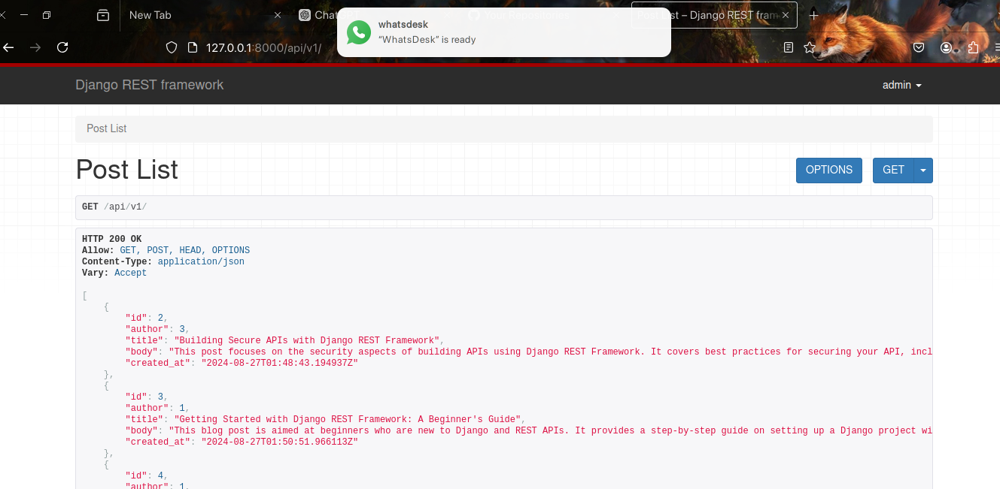
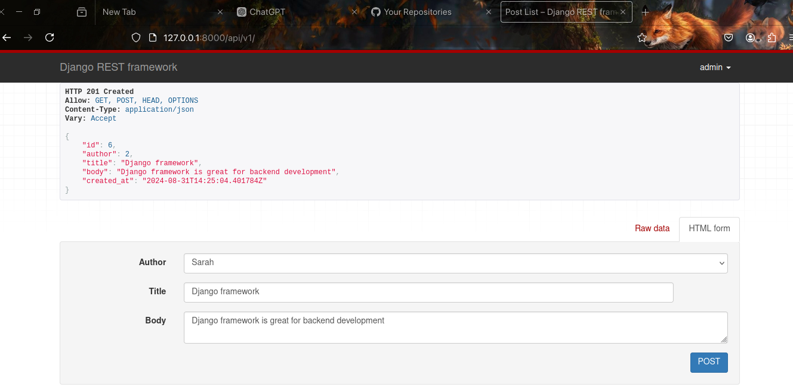
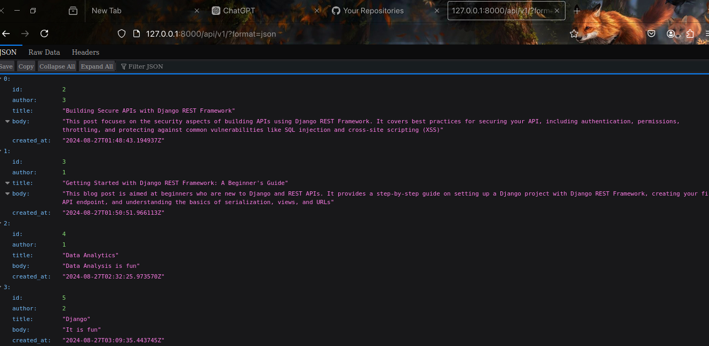
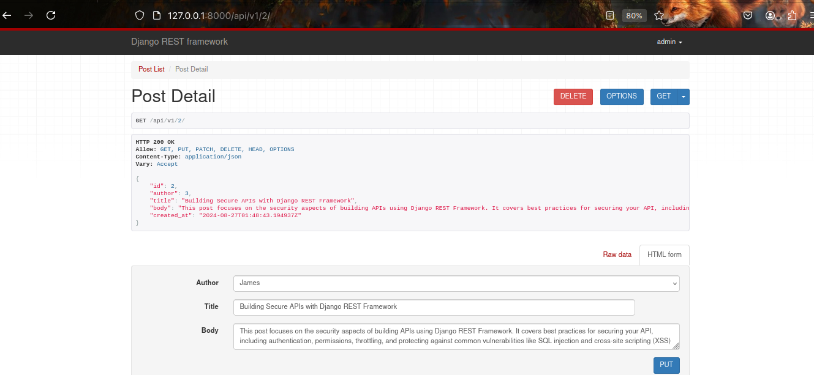

# Blog API

## Overview
The **Blog API** is a backend application built using Django that provides endpoints for creating, reading, updating, and deleting blog posts. This API includes robust authentication and permission settings to ensure that only authenticated users can perform CRUD (Create, Read, Update, Delete) operations.

## Features
- **CRUD Operations:** Allows users to create, retrieve, update, and delete blog posts.
- **Authentication:** Implements token-based authentication to ensure secure access to API endpoints.
- **Permissions:** Only authenticated users can perform CRUD operations, enhancing security and data integrity.
- **Error Handling:** Provides clear and consistent error messages for unauthorized or invalid requests.
  
## Tech Stack
- **Django:** Backend framework used for building the API.
- **Django REST Framework (DRF):** Facilitates API development and management of authentication and permissions.
- **SQLite / PostgreSQL:** Database used to store blog posts and user information.

## Installation
1. Clone the repository:
   ```bash
   git clone https//github.com/AyambaSumaila/blog-django-api
   ```
2. Navigate to the project directory:
   ```bash
   cd blog-api
   ```
3. Create a virtual environment:
   ```bash
   python -m venv venv
   ```
4. Activate the virtual environment:
   - On Windows:
     ```bash
     venv\Scripts\activate
     ```
   - On macOS/Linux:
     ```bash
     source venv/bin/activate
     ```
5. Install dependencies:
   ```bash
   pip install -r requirements.txt
   ```
6. Apply migrations:
   ```bash
   python manage.py migrate
   ```
7. Run the server:
   ```bash
   python manage.py runserver
   ```

## API Endpoints
- **POST /api/posts/** - Create a new blog post (authenticated users only).
- **GET /api/posts/** - Retrieve a list of all blog posts.
- **GET /api/posts/<id>/** - Retrieve a single blog post by ID.
- **PUT /api/posts/<id>/** - Update an existing blog post (authenticated users only).
- **DELETE /api/posts/<id>/** - Delete a blog post (authenticated users only).

## Screenshots






## Authentication and Permissions
- **Authentication:** Uses token-based authentication. Users must include a valid token in the header (`Authorization: Token <your_token>`) to access protected endpoints.
- **Permissions:** Configured to allow only authenticated users to perform CRUD operations, ensuring that only authorized users can modify the content.

## Importance of This API in Real-World Projects
1. **Secure Content Management:** By limiting access to authenticated users, the API ensures that only authorized individuals can create, modify, or delete content, safeguarding data integrity.
2. **Scalable and Extensible:** The modular structure allows easy integration with front-end frameworks (e.g., React, Angular) and mobile apps, enabling a seamless user experience.
3. **Enhances User Experience:** By allowing users to manage their content securely, the API provides a foundation for building dynamic and interactive blogging platforms.
4. **Promotes Best Practices:** Incorporates industry standards for authentication and data protection, crucial for developing secure and reliable web applications.

## Future Enhancements
- Implement role-based permissions to allow different levels of access (e.g., admin, editor, reader).
- Add search and filter functionality for blog posts.
- Integrate with third-party services for content distribution and analytics.

## Contributing
Contributions are welcome! Please fork the repository and create a pull request with your changes.

## License
This project is licensed under the MIT License.

Feel free to modify any section to better fit your specific implementation details!
